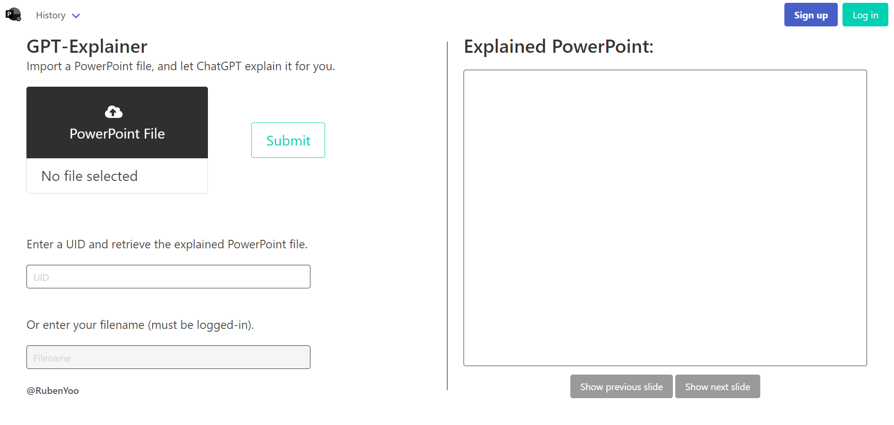
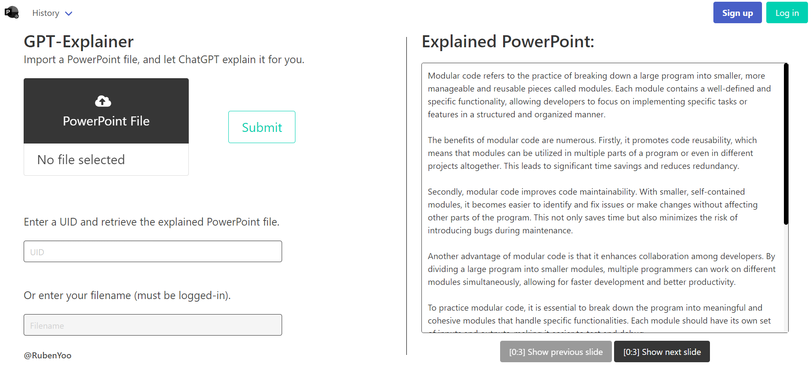

# GPT Explainer Project

## Overview

The GPT Explainer project is a Python application designed to facilitate comprehensive understanding of PowerPoint presentations. Tailored for students who may have missed a lecture, this tool extracts text from each slide of a PowerPoint file, asynchronously sends the content to the GPT API for analysis, and returns a UUID. This UUID serves as a key to retrieve explanation of the PowerPoint file.

## Features

### 1. PowerPoint Parsing

The application accepts PowerPoint files as input. Backend processing is employed to parse the files, extracting text from each slide for GPT analysis.

### 2. GPT API Integration

Parsed slide content is sent asynchronously to the GPT API. The API generates detailed explanations for each slide.

### 3. UUID Generation

Upon GPT analysis completion, the application generates a UUID associated with the processed PowerPoint file. This UUID facilitates the retrieval of the explanations on the website.

### 4. SQLite DataBase

User information and upload details are stored in an SQLite database. This ensures persistent storage of user data, including login credentials and information about uploaded PowerPoint files.

### 5. Website Integration

Users can access the website to upload PowerPoint files, monitor GPT analysis progress, and retrieve detailed explanations using the UUID.

### 6. Register/Login Feature

For enhanced user experience and security, the project includes a register/login feature. Users create accounts to track submitted PowerPoint files and access detailed explanations using only the file name.

## Use Case

### Scenario:

A student misses a lecture and needs to understand the content presented in a PowerPoint file. They upload the file to the GPT Explainer website. Backend processes extract slide content, which is asynchronously sent to the GPT API. The API generates detailed explanations for each slide, and the user receives a UUID for accessing explanations on the website.

## Benefits:

- **Efficiency:** Quick extraction of slide content with automated processing.
- **In-depth Insights:** GPT-powered explanations offer comprehensive understanding of each slide.
- **User Convenience:** UUID system facilitates easy retrieval of explanations on the website.
- **Security:** Register/login feature ensures secure access to explanations.
